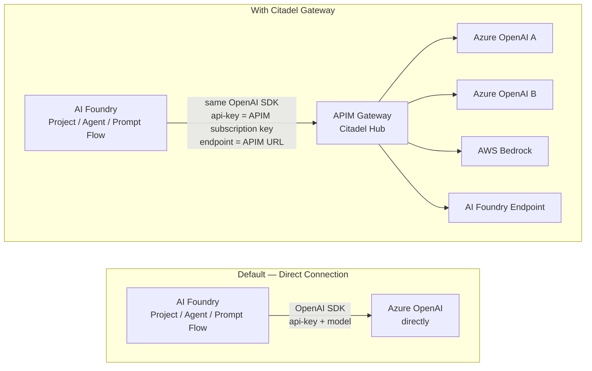
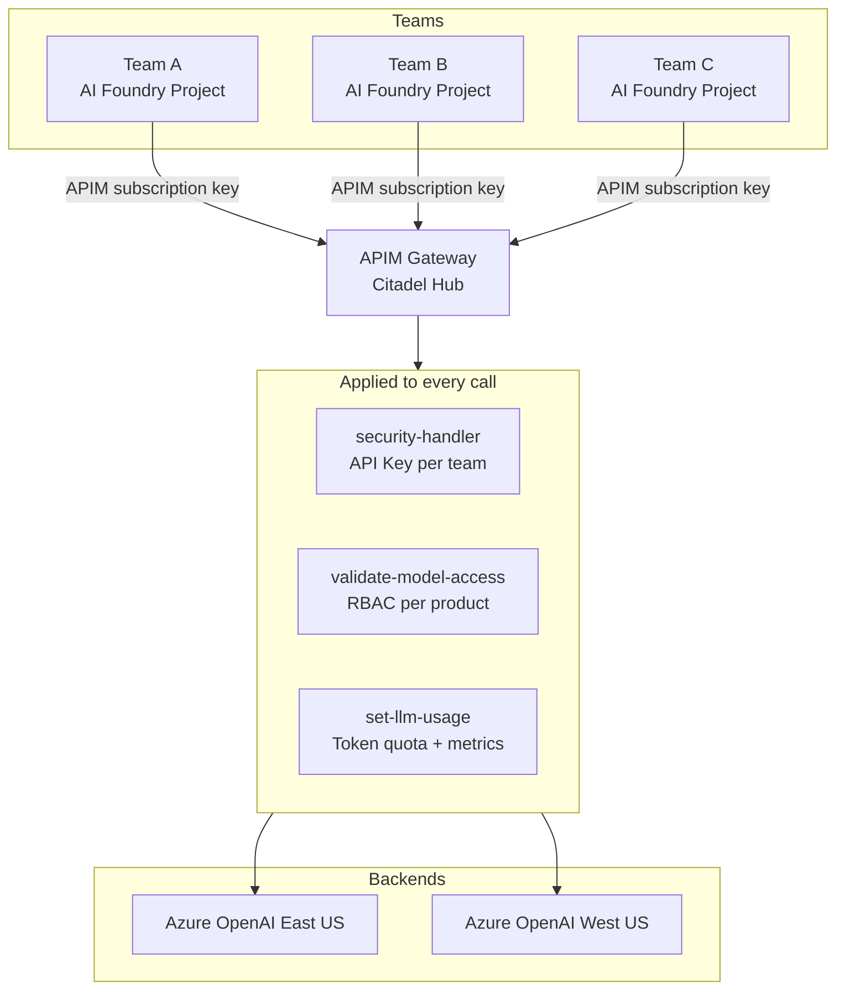
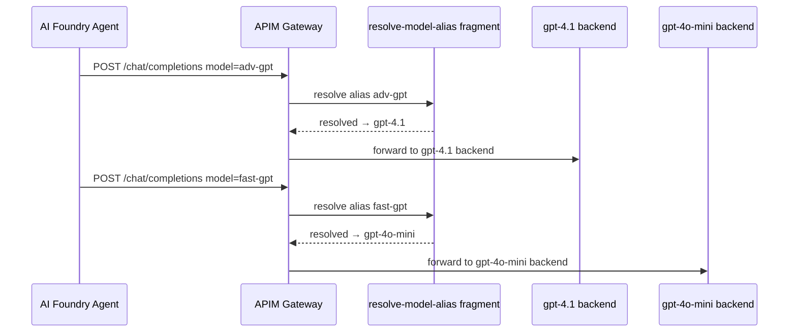
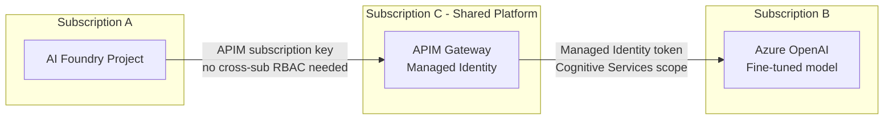
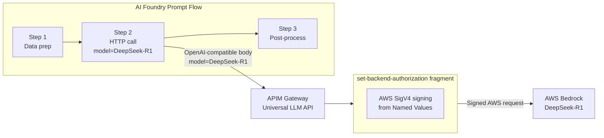
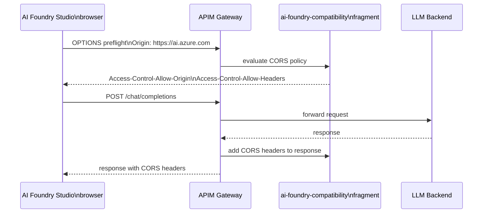

# Azure AI Foundry as an APIM Client

## Overview

By default, Azure AI Foundry connects directly to Azure OpenAI or other model endpoints. In the Citadel gateway pattern, you **reconfigure AI Foundry's connections to point at APIM instead**, making AI Foundry a client of the gateway. This enables centralized governance, model abstraction, and cross-backend routing without changing any application code.

---

## Default vs Gateway Architecture

The only change on the AI Foundry side is the **endpoint URL** and **API key** in the connected resource. No SDK changes, no code changes.

---

## Scenario 1 — Centralized Governance Across AI Foundry Projects

**Problem:** Multiple teams each have their own AI Foundry project calling Azure OpenAI directly. There is no unified token quota, audit trail, or PII filtering.

**Solution:** All projects point their connections at APIM. Governance is applied once at the gateway.

**What you gain:**
- One APIM subscription key per team — revoke centrally without touching AI Foundry
- Token usage reported per subscription key in Azure Monitor
- PII detection or content filtering applied uniformly before any request reaches the LLM
- Teams never see the underlying Azure OpenAI endpoints or keys

---

## Scenario 2 — Multi-Agent Orchestration with Model Switching

**Problem:** An AI Foundry Agent workflow calls multiple models in one session — a large model for reasoning, a small model for summarization, a specialized model for code. Hardcoding each model endpoint in the agent makes swapping models a redeployment event.

**Solution:** Agent calls APIM using model aliases. APIM resolves the alias to whatever real model is currently configured.

**What you gain:**
- Agent code uses stable alias names (`adv-gpt`, `fast-gpt`) — never hardcodes deployment IDs
- Platform team swaps underlying models by re-running onboarding Bicep — agents unaffected
- Weighted routing enables A/B testing: 70% of `adv-gpt` calls → `gpt-4.1`, 30% → `gpt-4o`
- Circuit breaker on backends automatically fails over within the pool

---

## Scenario 3 — Cross-Subscription / Cross-Region Access

**Problem:** An AI Foundry project in Subscription A needs a model only deployed in Subscription B (e.g. a fine-tuned model or a regional capacity reservation). Direct access requires complex cross-subscription RBAC or private endpoint peering.

**Solution:** APIM sits as the central broker. AI Foundry in any subscription calls APIM; APIM holds the managed identity credentials to reach any backend.

**What you gain:**
- AI Foundry project needs only an APIM subscription key — no Azure RBAC on the OpenAI resource
- The Managed Identity credential is held once in APIM, not replicated to every project
- Adding a new consumer is just creating an APIM subscription — no IAM change on the model resource

---

## Scenario 4 — Prompt Flow Accessing Non-Azure Models

**Problem:** An AI Foundry Prompt Flow pipeline needs to call AWS Bedrock or Anthropic Claude. AI Foundry has no built-in connector for these providers.

**Solution:** The pipeline uses an HTTP call step pointed at APIM's Universal LLM API. APIM handles the SigV4 signing, API key injection, and protocol translation transparently.

**What you gain:**
- Prompt Flow uses one consistent HTTP call format regardless of which LLM provider is behind APIM
- AWS credentials never stored in AI Foundry — held as APIM Named Values
- Swapping from Bedrock to a different provider requires no Prompt Flow changes

---

## Scenario 5 — AI Foundry Studio CORS and Browser Clients

**Problem:** Developers use AI Foundry Studio's Chat playground to test prompts. When the AI Foundry workspace connection points at APIM, the Studio browser makes cross-origin requests to APIM. Without CORS headers, the browser blocks the response.

**Solution:** The `ai-foundry-compatibility` policy fragment (included in `universal-llm-api-policy-v2.xml`) adds the required CORS response headers.

Without this fragment, the Studio Chat playground fails with a CORS error even when the underlying routing is correct.

---

## How to Configure AI Foundry to Use APIM

In Azure AI Foundry, a **Connected Resource** defines which model endpoint a project or agent uses. Change the endpoint from the Azure OpenAI URL to the APIM URL:

| Setting | Direct connection | Via APIM |
|---|---|---|
| Endpoint URL | `https://<aoai-name>.openai.azure.com/` | `https://<apim-name>.azure-api.net/<api-path>/` |
| API Key | Azure OpenAI key or Managed Identity | APIM subscription key |
| API Version | Azure OpenAI `api-version` param | Same — passed through unchanged |
| SDK | Azure OpenAI SDK / OpenAI SDK | Same — no change needed |

The AI Foundry SDK sends requests in the same OpenAI-compatible format — APIM accepts and routes them transparently.

---

## When to Use This Pattern

| Situation | Recommended? |
|---|---|
| Multiple teams sharing LLM capacity and you need per-team quotas | Yes |
| Agents using model aliases and you need to swap models without redeployment | Yes |
| Prompt Flow needs AWS Bedrock or other non-Azure providers | Yes |
| Single team, single Azure OpenAI resource, no governance requirements | No — adds latency without benefit |
| Real-time streaming with very low latency requirements | Evaluate — APIM adds ~10-30ms per hop |
| Fine-tuned model in a different subscription | Yes |

---

## Key Policy Fragment Reference

| Fragment | Why it matters for AI Foundry clients |
|---|---|
| `security-handler` | Validates the APIM subscription key passed by AI Foundry as `api-key` header |
| `resolve-model-alias` | Allows AI Foundry agents to use stable alias names instead of deployment IDs |
| `validate-model-access` | Restricts which models an AI Foundry product subscription can access |
| `ai-foundry-compatibility` | Adds CORS headers required by AI Foundry Studio browser client |
| `set-backend-authorization` | Injects real credentials toward backend — AI Foundry never sees backend keys |
| `set-llm-usage` | Records token usage per AI Foundry project subscription key |
