# APIM Gateway Concepts — Brief Guide

> This guide explains the core building blocks of the Citadel AI Hub Gateway in plain language. No configuration details, no code — just concepts, analogies, and diagrams. Read this before the architecture reference documents.

---

## The Big Picture — APIM as a Hotel Concierge

Imagine a large hotel. Guests never walk directly into the kitchen, the laundry room, or the maintenance department. Instead, they go to the **concierge desk**. The concierge:

- Checks that the guest is actually staying at the hotel (authentication)
- Decides which department can handle the request
- Passes the request along and brings back the response
- Keeps a log of every interaction

**Azure API Management (APIM)** is that concierge desk — but for AI model calls.

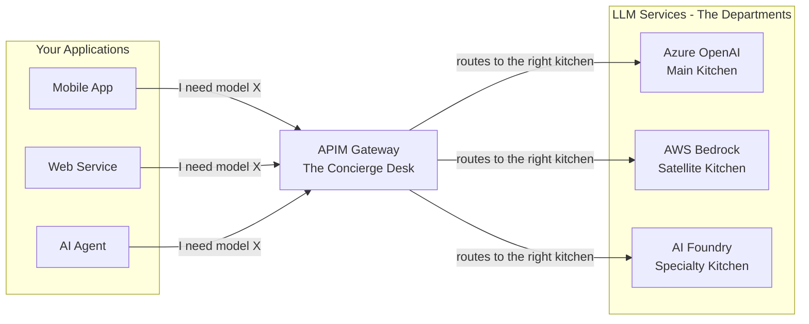

Your application never needs to know which kitchen is handling the order, where it is, or how to authenticate to it. The concierge handles all of that.

---

## What is a Policy?

A **Policy** is the set of rules the concierge follows for every request. Think of it as a checklist printed on a card at the front desk:

```
☐ 1. Check that the guest has a valid room key
☐ 2. Note which service they are asking for
☐ 3. Check if they are allowed to use that service
☐ 4. Route to the appropriate department
☐ 5. On the way back, record how much was consumed
```

In APIM, every API has a policy attached to it. The policy is executed in order, top to bottom, on every single request that comes through that API.

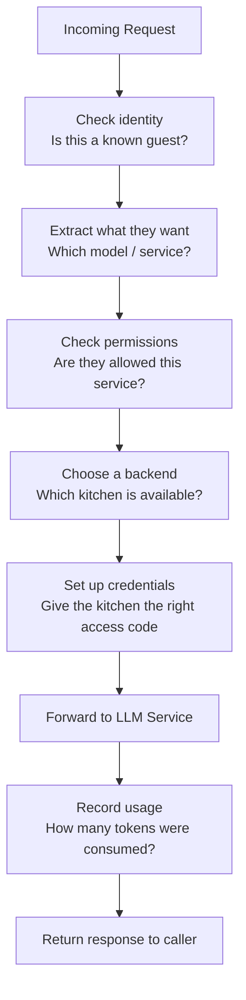

Policies run in two directions: **inbound** (as the request arrives) and **outbound** (as the response goes back).

---

## What is a Policy Fragment?

Here is a problem with the checklist idea: the hotel has **many desks** — the main reception, the restaurant desk, the spa desk — and they all share some of the same rules. If you print the same "check the guest's room key" rule on every desk's checklist, and that rule needs to change, you have to update every card.

A **Policy Fragment** solves this by letting you write a rule once, give it a name, and store it centrally. Each desk's checklist simply says "refer to the Guest Verification card" at the right step.

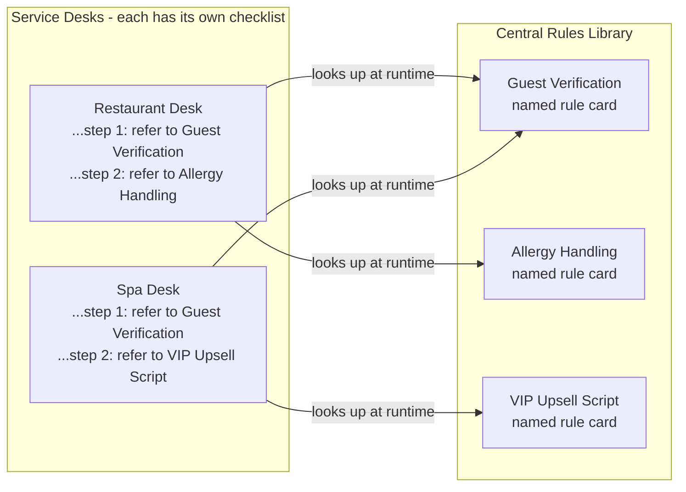

In APIM:
- The **named rule cards** are called **Policy Fragments**
- The **service desks** are called **APIs** (each with its own policy)
- Each API policy has instructions like "refer to the Guest Verification card" written as `<include-fragment fragment-id="security-handler"/>`

---

## What is Include Fragment?

**Include Fragment** is the instruction in a policy that says "at this point, go fetch and apply a named fragment."

The key insight: the fragment is **looked up and applied at the moment the request arrives**, not when the checklist was printed. This means:

- If you update the "Guest Verification" card, all desks automatically use the updated version — no reprinting
- If you add new instructions to a card, every desk that references it picks up the change instantly

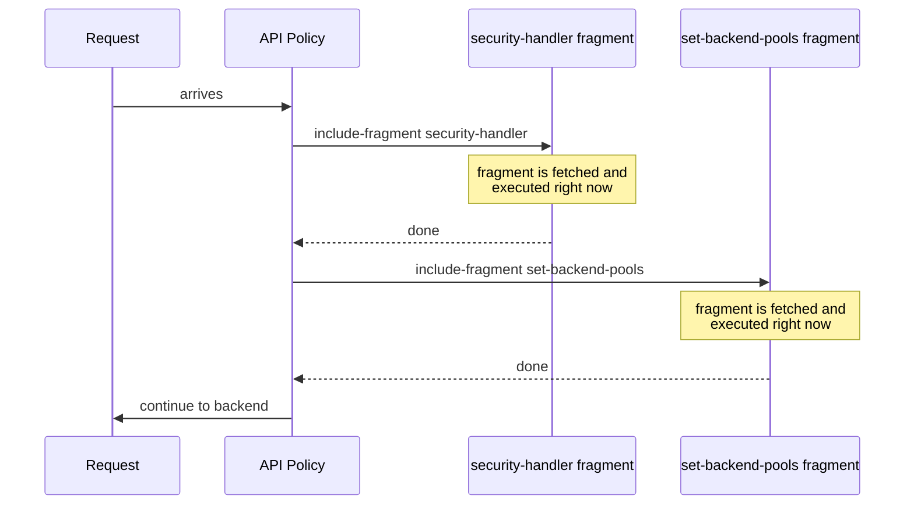

The policy file itself is rarely touched. The fragments do all the real work and can be updated independently.

---

## What is a Backend?

A **Backend** in APIM is a registered address for one specific LLM service endpoint. Think of it as a contact card in the concierge's address book:

```
Name:     azure-openai-eastus
Address:  https://my-aoai.openai.azure.com/
Auth:     Managed Identity
Notes:    Supports gpt-4.1, gpt-4o
```

When APIM decides to send a request to Azure OpenAI East US, it looks up this contact card to find the URL, authentication method, and any other settings needed to reach that specific service.

Each backend is registered once. The concierge can route to it from any API.

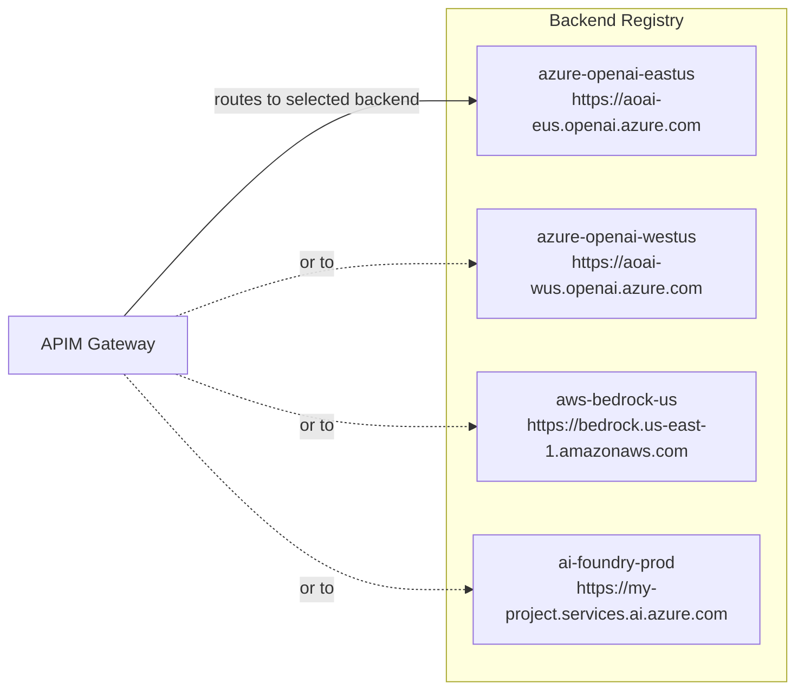

---

## What is a Backend Pool?

A single backend is one kitchen. What if that kitchen is full, closed for maintenance, or you want to spread the load across several kitchens?

A **Backend Pool** is a group of backends that can all handle the same type of request. The pool acts as a single contact in the address book, but internally it manages a list of individual kitchens and decides which one to use.

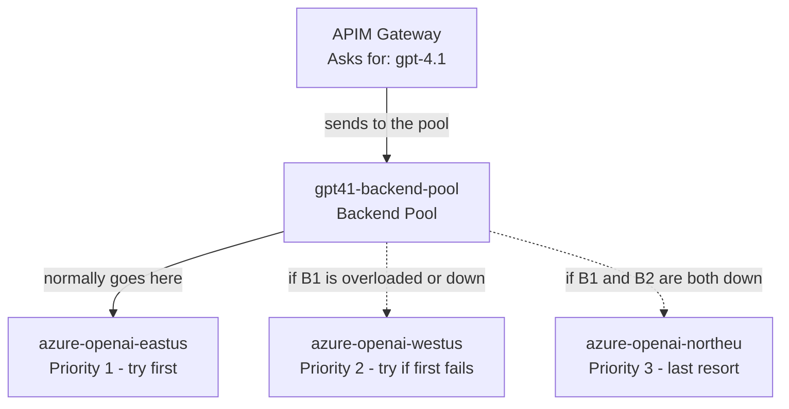

**Why this matters:**
- If one Azure OpenAI region hits its rate limit, the pool silently tries the next one — the caller sees no error
- You can assign weights: send 70% of traffic to the cheaper region and 30% to the faster region
- You can add a new backend to the pool without changing anything the caller does

A model served by only one backend routes directly (no pool needed). A pool is created automatically when two or more backends support the same model.

---

## How Does Load Balancing Work? — Priority and Weight

A backend pool contains multiple backends. The pool uses two controls to decide where each request goes: **priority** and **weight**. They solve different problems and work at different levels.

### Priority — Which tier to try first

Think of priority like **queue numbers at a hospital**. Priority 1 patients are seen first. The doctor only calls a priority 2 patient when all priority 1 patients have been attended to. In a backend pool, APIM only tries lower-priority backends when every higher-priority backend has its circuit breaker tripped.

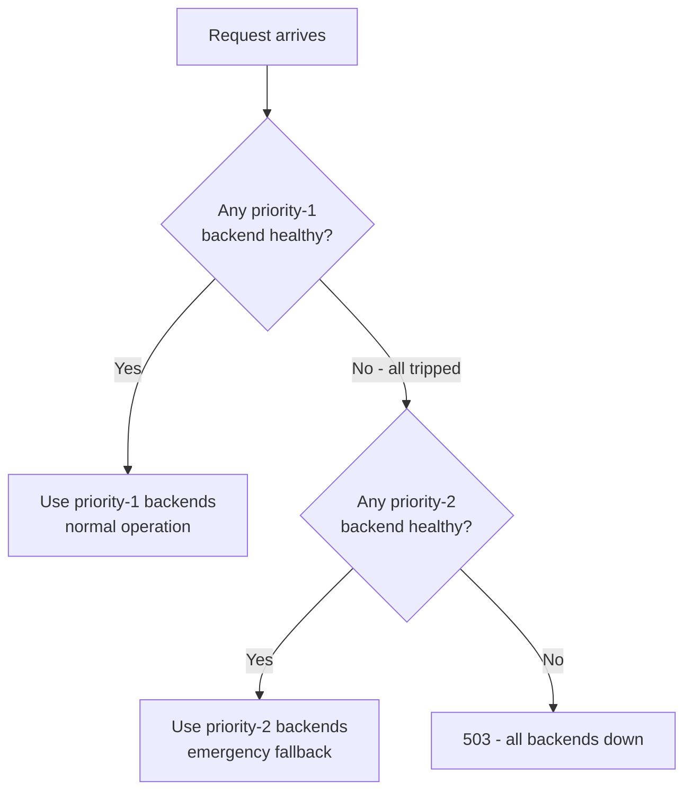

### Weight — How to split traffic within the same priority tier

Weight is like **assigning lanes on a highway**. All lanes in a tier carry traffic at the same time — more lanes means more throughput. If two backends share the same priority and one has weight 70 while the other has weight 30, that backend receives 70 out of every 100 requests.

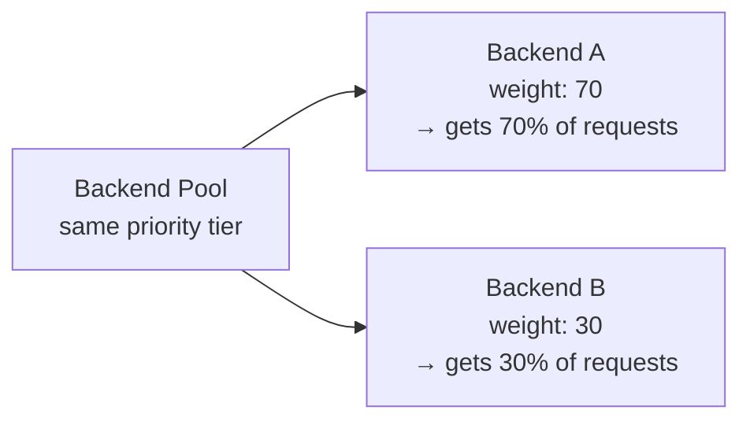

When a backend's circuit breaker trips, it is temporarily removed from the weight calculation. The remaining healthy backends absorb its share proportionally until it recovers.

### The two levels of routing — backend pools vs model aliases

There are actually **two separate places** where priority and weight apply, and they operate independently. A simple way to remember it:

> **Alias = model name level. Pool = physical endpoint level.**

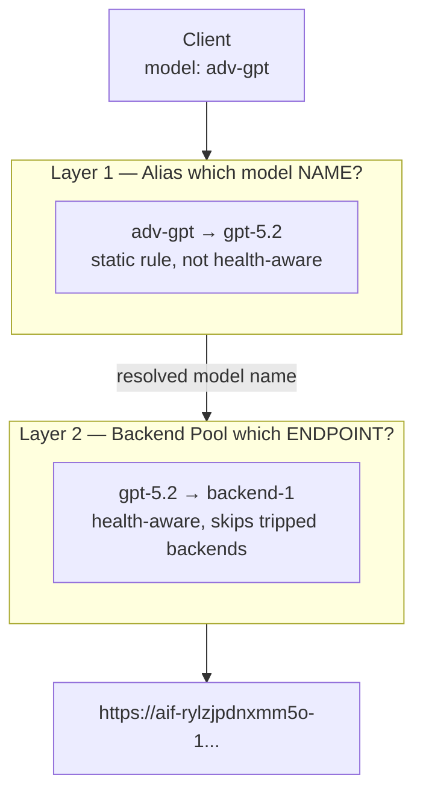

| Level | What it controls | Health-aware? |
|---|---|---|
| **Model alias** | Which model name to put in the request | No — blindly picks first or random |
| **Backend pool** | Which physical endpoint URL to call | Yes — skips circuit-broken endpoints |

Example: a request for alias `ab-test-gpt` first goes through alias resolution (80% → `gpt-5.4-mini`, 20% → `gpt-4.1`), and then the chosen model name is looked up in the backend pool to find the physical endpoint. Both levels apply on every request.

---

## What is a Circuit Breaker?

Imagine you keep calling a kitchen that is clearly having a bad day — every order comes back burnt. A sensible manager would say: "Stop sending orders to that kitchen for 10 minutes. Let them recover."

A **Circuit Breaker** does exactly this automatically. Each backend has a circuit breaker configured on it. If a backend returns too many errors in a short time, the circuit breaker **trips** — APIM stops sending requests to that backend and immediately tries the next one in the pool.

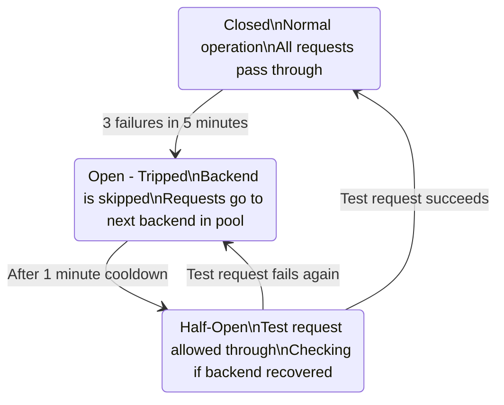

The circuit breaker protects both the caller (who gets a fast response from a healthy backend instead of waiting for a broken one to time out) and the struggling backend (which gets a rest period to recover).

---

## What are Named Values?

A Named Value is a piece of configuration — like a password or a URL — stored securely in APIM and referenced by a short name instead of by its actual value.

Think of it as a **manager's locked filing cabinet**. Instead of every staff member memorising the safe combination (and the combination changing every 90 days), there is one filing cabinet. Staff just say "get me the contents of the AWS credentials folder" — they never see the actual credentials.

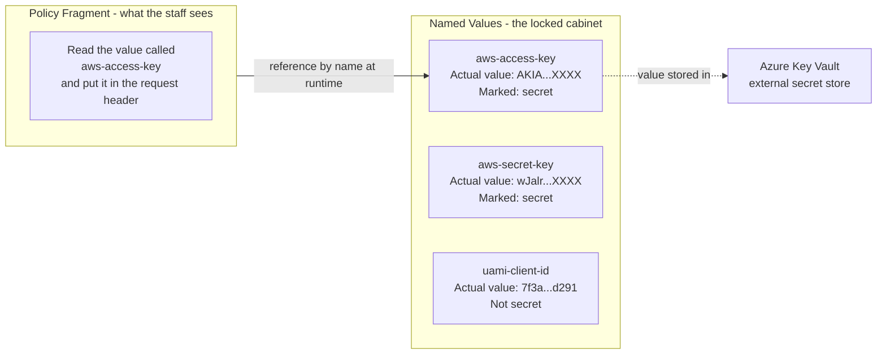

**Key properties:**
- The policy fragment never contains the actual secret value — only the name
- Secrets can be rotated (value updated in the cabinet) without changing the policy
- Some named values point to Azure Key Vault, so the actual value never even lives in APIM

---

## What is a Model Alias?

Different teams have different needs. One team always wants the best available model for complex reasoning. Another always wants the fastest model for simple tasks. But the specific model names change over time — `gpt-4` becomes `gpt-4.1` becomes `gpt-4.2`.

A **Model Alias** is a stable nickname that maps to one or more real models behind the scenes.

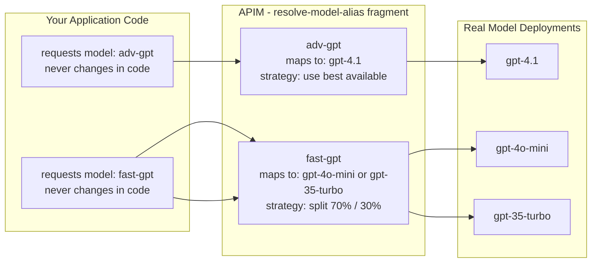

**Two routing strategies for aliases:**

| Strategy | Behaviour | Use case |
|---|---|---|
| **Priority** | Try the first model, fall back to next if unavailable | Always use the best; fall back gracefully |
| **Weighted** | Split traffic by percentage | A/B testing; cost optimisation |

When the platform team upgrades from `gpt-4.1` to `gpt-4.2`, they update the alias mapping. Every application using `adv-gpt` automatically gets the new model — with no code changes and no redeployment.

---

## How All the Pieces Work Together

Putting it all together: a single request goes through every layer described above.

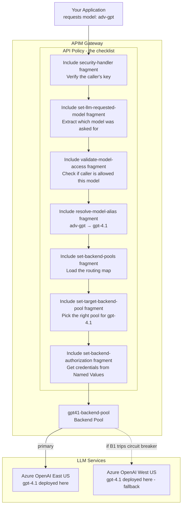

**The caller's experience:** send one request, get one response. Everything in the middle is invisible.

**The platform team's control:** every box in the middle can be updated independently — swap a model, rotate a key, add a new backend, change routing weights — without the caller knowing or needing to change their code.

---

## What Does It Mean for AI Foundry to Be an APIM Client?

So far we have described AI Foundry as a **kitchen** — a backend that APIM routes requests *to*. But AI Foundry can also play the role of a **guest** — making requests *through* APIM just like any other application.

Think of it this way: a sous-chef in one of the hotel's kitchens sometimes needs to order special ingredients from external suppliers. Instead of calling each supplier directly (with their own accounts, their own delivery rules, no central oversight), the smart approach is to go through the hotel's **concierge desk** — the same desk all guests use. That way, the same policies apply: every order is logged, budgets are enforced, and the sous-chef never has to manage supplier credentials themselves.

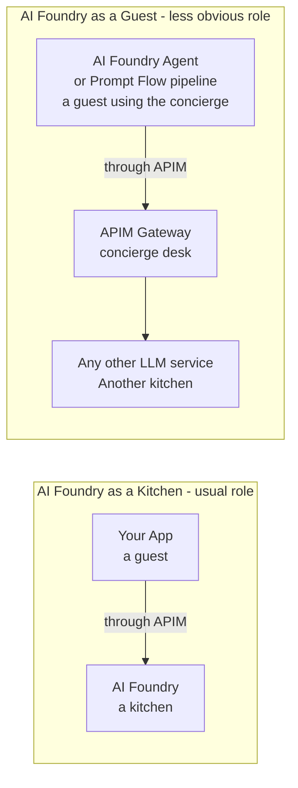

**The same entity, two different roles depending on context.**

### When does this happen?

**Scenario 1 — An AI agent that calls multiple models**
An AI Foundry Agent might use a large model for reasoning and a small model for summarising. If those calls go through APIM, the agent uses stable alias names (`adv-gpt`, `fast-gpt`) and the platform team can swap the underlying models at any time — the agent never changes.

**Scenario 2 — Prompt Flow needing a model that isn't Azure**
An AI Foundry Prompt Flow pipeline needs to call AWS Bedrock or Anthropic. AI Foundry has no direct connector for those. If the pipeline sends its request to APIM instead, APIM handles the routing, authentication, and protocol differences transparently.

**Scenario 3 — Centralised governance across many AI Foundry projects**
Ten teams each have an AI Foundry project, all calling Azure OpenAI independently. There is no shared token budget, no central audit log. By pointing all those projects at APIM, the platform team gets visibility and control in one place — without asking each team to change their application code.

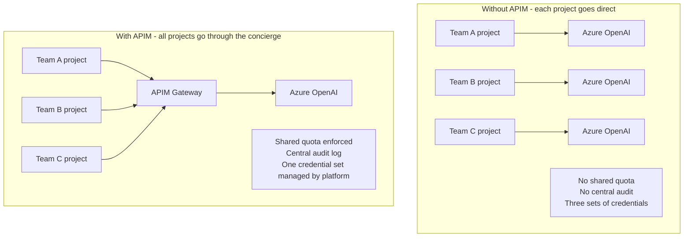

### The key idea

AI Foundry is not just one thing. It can be:
- A **backend** — hosting model deployments that APIM routes requests to
- A **client** — running agents and pipelines that make requests through APIM

In a mature enterprise setup, it is often **both at the same time**: some AI Foundry endpoints sit behind APIM as backends, while AI Foundry agent workflows call other models through APIM as a client.

---

## Summary — One-Line Definitions

| Concept | Plain language definition |
|---|---|
| **APIM** | The concierge desk — all AI requests go through here |
| **API** | A named service endpoint exposed through APIM, with its own checklist of rules |
| **Policy** | The ordered checklist of rules applied to every request on an API |
| **Policy Fragment** | A named, reusable rule card stored centrally and referenced by multiple policies |
| **Include Fragment** | An instruction in a policy to fetch and apply a named fragment at that step |
| **Backend** | A registered address for one specific LLM service |
| **Backend Pool** | A group of backends that can serve the same model, with automatic failover |
| **Named Value** | A securely stored config value referenced by name — the locked filing cabinet |
| **Circuit Breaker** | An automatic fuse that stops sending requests to a failing backend temporarily |
| **Model Alias** | A stable nickname for one or more models, so application code never has to change |
| **AI Foundry as client** | AI Foundry acting as the guest instead of the kitchen — its agents and pipelines call models through APIM just like any other application |
