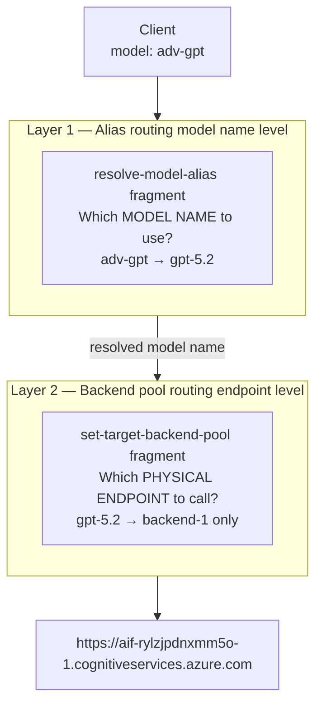
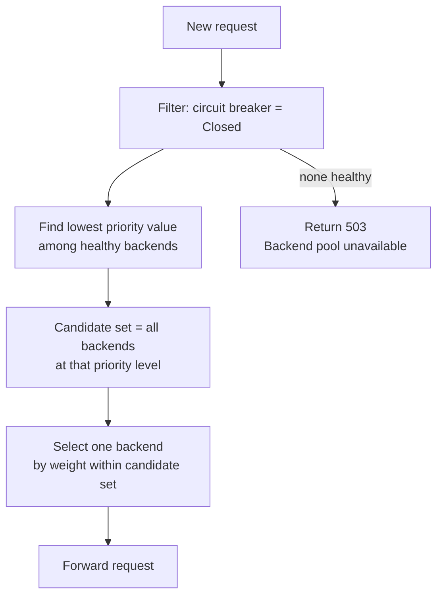
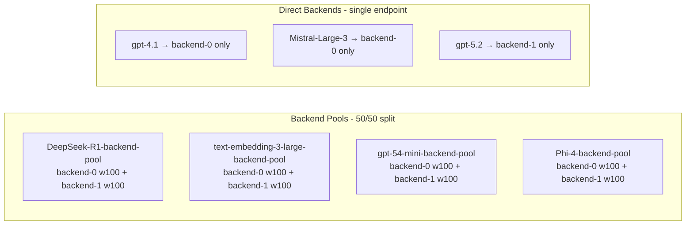
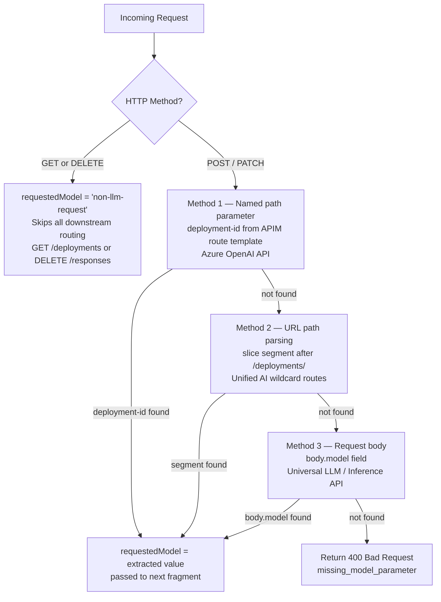
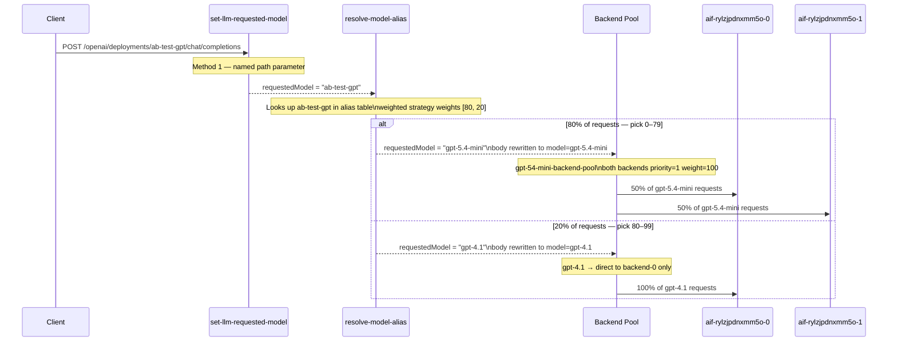
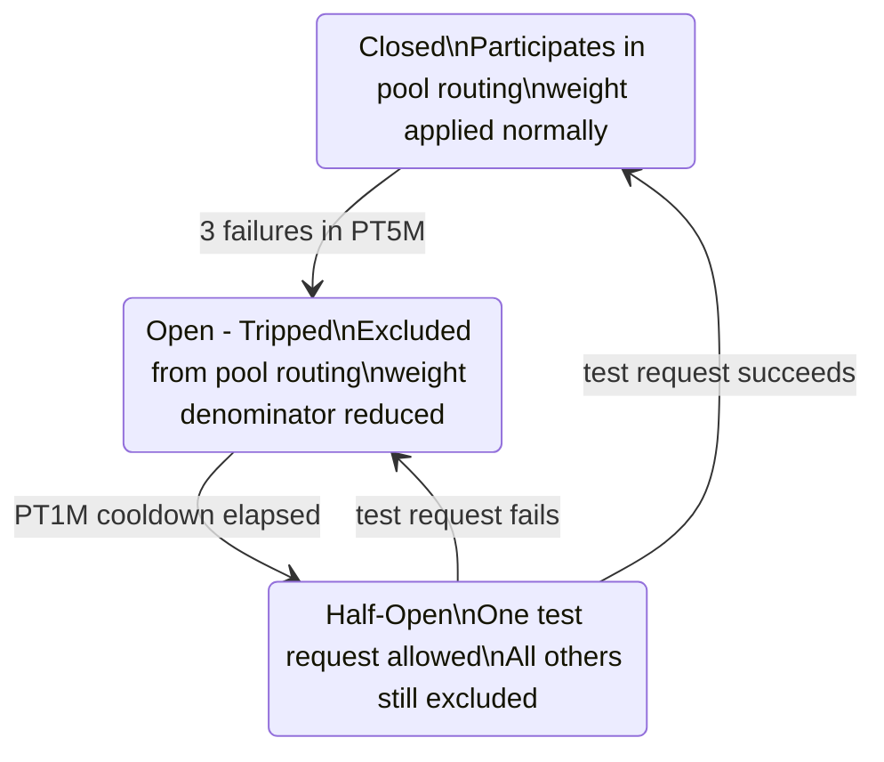
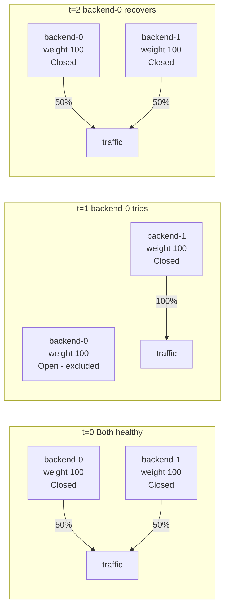

# APIM Backend Pool Load Balancing — Technical Reference

## Overview

The Citadel gateway implements **two independent routing layers** that both apply on every request. Understanding both is essential for configuring capacity and failover correctly.

| Layer | Question answered | Input | Output | Configured in |
|---|---|---|---|---|
| **Model alias** | Which model name to use? | Client alias (`adv-gpt`) | A model name (`gpt-5.2`) | `modelAliases` param → `resolve-model-alias` fragment |
| **Backend pool** | Which physical endpoint to call? | Resolved model name (`gpt-5.2`) | An HTTP endpoint URL | `llmBackendConfig` priority/weight → APIM Backend Pool resource |

These layers are applied **sequentially on every request**: alias resolution first, backend pool routing second.



**Key distinction:**
- Alias layer is **not health-aware** — it blindly picks a model name using a static rule
- Backend pool layer **is health-aware** — it skips circuit-broken endpoints dynamically on every request

---

## Layer 1 — Backend Pool Routing

### Resource structure

Each backend in a pool is registered with two routing parameters:

```bicep
pool: {
  services: [
    {
      id: '/backends/aif-rylzjpdnxmm5o-0'
      priority: 1      // integer — lower = higher priority
      weight: 100      // integer — proportional share within same priority tier
    }
    {
      id: '/backends/aif-rylzjpdnxmm5o-1'
      priority: 1
      weight: 100
    }
  ]
}
```

### Priority algorithm

APIM groups pool members by `priority` value and forms tiers. The algorithm on each request:

1. Identify all backends whose circuit breaker is currently **Closed** (healthy)
2. Find the **lowest priority number** among those healthy backends
3. Route only to backends in that lowest tier
4. If no healthy backends exist in any tier → return 503



**Key behaviour:** A priority-2 backend never receives traffic while any priority-1 backend is healthy — it is not a fallback for an overloaded primary, only for a completely failed one. Overload conditions are handled by the circuit breaker, which eventually trips and removes the backend from the healthy set.

### Weight algorithm

Within a priority tier, APIM distributes requests proportionally by weight using **weighted random selection**:

```
P(backend A selected) = weight_A / sum(weight_all_healthy_in_tier)
```

Example — two backends, same priority, equal weight:
```
P(A) = 100 / (100 + 100) = 50%
P(B) = 100 / (100 + 100) = 50%
```

Example — two backends, same priority, unequal weight:
```
P(A) = 70 / (70 + 30) = 70%
P(B) = 30 / (70 + 30) = 30%
```

When backend A's circuit breaker trips, it is removed from the denominator:
```
P(B) = 30 / 30 = 100%   (A is excluded while tripped)
```

Weight values are **relative**, not absolute percentages. A pool with weights [100, 100] behaves identically to one with weights [1, 1] or [50, 50].

### Current deployment — real config

From `llm-backends-generated-local.bicepparam`:

```
aif-rylzjpdnxmm5o-0   priority=1  weight=100
  models: gpt-4.1, DeepSeek-R1, text-embedding-3-large,
          Mistral-Large-3, gpt-5.4-mini, Phi-4

aif-rylzjpdnxmm5o-1   priority=1  weight=100
  models: Phi-4, gpt-5.4-mini, gpt-5.2,
          DeepSeek-R1, text-embedding-3-large
```

Pool creation result (models with 2 backends → pool; models with 1 backend → direct):



Note: pool names strip dots from model names (`gpt-5.4-mini` → `gpt-54-mini-backend-pool`) because APIM resource names cannot contain dots.

---

## Bridge — How `requestedModel` Is Extracted

Before alias resolution or backend pool routing can happen, the gateway must know **which model the client is asking for**. This is the job of the `set-llm-requested-model` fragment, which runs first in the inbound pipeline.

The model name can be in three different places depending on which API the client uses. The fragment tries them in order:



### Method 1 — Named path parameter (Azure OpenAI API)

The Azure OpenAI API route is registered in APIM with a named template (`/openai/deployments/{deployment-id}/...`). APIM automatically parses the URL and populates `MatchedParameters["deployment-id"]`.

```
POST /openai/deployments/adv-gpt/chat/completions
                          ↑↑↑↑↑↑↑
                          APIM extracts this via route template
                          requestedModel = "adv-gpt"
```

### Method 2 — URL path parsing (Unified AI wildcard routes)

Unified AI uses wildcard routes with no named parameters. The code manually searches for `/deployments/` in the path and slices the next segment:

```
path = "/ai/deployments/adv-gpt/chat/completions"
                         ↑↑↑↑↑↑↑
                         sliced between /deployments/ and next /
                         requestedModel = "adv-gpt"
```

### Method 3 — Request body (Universal LLM / Inference API)

Universal LLM API has no model name in the URL — the model is in the JSON body:

```
POST /universalllm/chat/completions
{ "model": "adv-gpt", "messages": [...] }
        ↑↑↑↑↑↑↑↑↑
        extracted from body.model
        requestedModel = "adv-gpt"
```

### Validation gate

If all three methods fail, APIM returns **400** immediately — the request never reaches alias resolution or a backend:

```json
{
  "error": {
    "code": "missing_model_parameter",
    "message": "Model could not be detected from request body or path"
  }
}
```

### The `non-llm-request` sentinel

`GET /openai/deployments` (listing models) and `DELETE /responses/{id}` have no model to route to. The fragment sets `requestedModel = "non-llm-request"`. Every downstream fragment checks for this sentinel and skips itself:

```csharp
// In resolve-model-alias (line 51):
if (model.Equals("non-llm-request", ...)) return false;  // entire alias block skipped
```

### Variable handoff chain

Every fragment in the inbound pipeline reads and writes `requestedModel` in sequence through `context.Variables`:

```
set-llm-requested-model   →  writes  requestedModel = "adv-gpt"
resolve-model-alias        →  reads "adv-gpt", overwrites requestedModel = "gpt-5.2"
set-backend-pools          →  reads "gpt-5.2", builds routing table
set-target-backend-pool    →  reads "gpt-5.2", selects backend pool
set-backend-authorization  →  reads selected backend, injects credentials
```

---

## Layer 2 — Model Alias Routing

Model aliases are resolved inside the `resolve-model-alias` policy fragment. The alias map is **generated at Bicep compile time** and baked into the fragment as static C# code. No runtime lookup is needed.

### Priority strategy

The alias `models` array is treated as an ordered preference list. APIM selects the **first model in the list that maps to a healthy backend**.

```
adv-gpt → ["gpt-5.2", "gpt-5.4-mini", "gpt-4.1"]   strategy: priority
```

Resolution logic:
1. Try `gpt-5.2` — is this model reachable? (Is its backend/pool healthy?)
2. If yes → use `gpt-5.2`, stop
3. If no → try `gpt-5.4-mini`
4. If no → try `gpt-4.1`
5. If none reachable → return error

### Weighted strategy

Traffic is split across models by the `weights` array (parallel to `models` array). Selection is proportional random, identical in mechanism to backend pool weight.

```
ab-test-gpt → models: ["gpt-5.4-mini", "gpt-4.1"]
              weights: [80, 20]
              strategy: weighted
```

```
P(gpt-5.4-mini selected) = 80 / (80 + 20) = 80%
P(gpt-4.1 selected)      = 20 / (80 + 20) = 20%
```

Unlike backend pool priority, alias weighted strategy does **not** automatically fail over to other models if the selected model is unavailable — the request goes to that model regardless. If resilience is needed, use `priority` strategy instead.

### Implementation — actual C# behaviour

**Priority strategy** (from `frag-resolve-model-alias.xml` line 122):
```csharp
// Default 'priority' strategy: first model wins.
return models[0].ToString();
```
Always returns the first model. No health check. The remaining models in the list are stored in `alias-models` for the Unified AI API retry block only.

**Weighted strategy** (cumulative range selection):
```csharp
int totalWeight = 0;
foreach (var w in weights) { totalWeight += w.Value<int>(); }
int pick = new Random().Next(0, totalWeight);   // e.g. 0–99 for weights [80,20]
int cumulative = 0;
for (int i = 0; i < models.Count; i++) {
    cumulative += weights[i].Value<int>();
    if (pick < cumulative) { return models[i].ToString(); }
}
```
For weights `[80, 20]`: picks 0–79 → first model, 80–99 → second model.

**Output variables set by the fragment:**

| Variable | Purpose |
|---|---|
| `requestedModel` | Resolved model name — used by all downstream fragments for routing |
| `original-model-alias` | Original alias name — used by Azure OAI policy to rewrite the URL path |
| `is-alias` | Boolean flag — used by response headers and usage fragments |
| `alias-models` | Full JArray of all models in alias — used by Unified AI API retry block for cross-model fallback |

**Two alias map sources** (checked in order):
1. `config-model-aliases` — loaded by `central-cache-manager` fragment (Unified AI API path only)
2. `inline-model-aliases` — static JObject baked into the fragment at Bicep deploy time (all APIs)

### Current deployment — all aliases

From `llm-backends-generated-local.bicepparam`:

| Alias | Models (in order) | Strategy | Actual behaviour |
|---|---|---|---|
| `adv-gpt` | gpt-5.2, gpt-5.4-mini, gpt-4.1 | priority | **Always** sends to gpt-5.2. Cross-model fallback only available via Unified AI API retry |
| `fast-gpt` | gpt-5.4-mini, gpt-4.1 | priority | **Always** sends to gpt-5.4-mini. gpt-4.1 is fallback only on Unified AI |
| `reasoning` | DeepSeek-R1, gpt-5.2 | priority | **Always** sends to DeepSeek-R1. gpt-5.2 fallback only on Unified AI |
| `embeddings` | text-embedding-3-large | priority | Single model, no alias branching |
| `ab-test-gpt` | gpt-5.4-mini, gpt-4.1 | weighted 80/20 | Random pick per request — 80% gpt-5.4-mini, 20% gpt-4.1. No fallback if selected model is unavailable |

---

## Combined Routing — Full Decision Path

A request for `ab-test-gpt` passes through all three stages. Using `POST /openai/deployments/ab-test-gpt/chat/completions` as the example:



### Context variable state at each stage

| Stage | `requestedModel` | `original-model-alias` | `is-alias` |
|---|---|---|---|
| After `set-llm-requested-model` | `"ab-test-gpt"` | `""` | `false` |
| After `resolve-model-alias` | `"gpt-5.4-mini"` or `"gpt-4.1"` | `"ab-test-gpt"` | `true` |
| After `set-target-backend-pool` | unchanged | unchanged | unchanged |

### Overall traffic distribution for `ab-test-gpt`

- backend-0 receiving `gpt-5.4-mini`: 80% × 50% = **40%**
- backend-1 receiving `gpt-5.4-mini`: 80% × 50% = **40%**
- backend-0 receiving `gpt-4.1`: 20% × 100% = **20%**
- backend-1 receiving `gpt-4.1`: 0%

---

## Circuit Breaker Interaction

The circuit breaker is configured per backend resource (not per pool). Its state directly affects pool routing.

### Thresholds (current config)

```
failures required to trip : 3
failure window            : PT5M  (5 minutes)
trip duration             : PT1M  (1 minute)
status codes counted      : 429, 500–503
acceptRetryAfter          : true  (honours Retry-After header from 429)
```

### State transitions and routing impact



### Failover scenario with two equal-weight priority-1 backends



---

## Configuration Reference

### Adding a new backend to an existing pool

Add an entry to `llmBackendConfig` in the `.bicepparam` file and re-run the onboarding deployment. The pool is rebuilt automatically from the updated `modelToBackendsMap`.

```bicep
// New backend, same priority as existing ones — joins pool as equal peer
{
  backendId: 'aif-new-region'
  backendType: 'ai-foundry'
  endpoint: 'https://aif-new.cognitiveservices.azure.com/'
  supportedModels: [
    { name: 'gpt-5.4-mini', ... }   // same model → joins gpt-54-mini-backend-pool
  ]
  priority: 1
  weight: 100    // equal weight → 33% each with two existing backends
}
```

### Creating a warm standby (primary + backup)

Assign different priority values. The backup backend is registered but never receives traffic until the primary fails.

```bicep
// Primary
{ backendId: 'aoai-primary', supportedModels: [...], priority: 1, weight: 100 }
// Warm standby — only used if primary trips
{ backendId: 'aoai-standby', supportedModels: [...], priority: 2, weight: 100 }
```

### Gradual traffic migration

Start with a small weight on the new backend, confirm behaviour, then increase.

```bicep
// Phase 1 — 10% to new backend
{ backendId: 'aoai-old', priority: 1, weight: 90 }
{ backendId: 'aoai-new', priority: 1, weight: 10 }

// Phase 2 — 50/50
{ backendId: 'aoai-old', priority: 1, weight: 50 }
{ backendId: 'aoai-new', priority: 1, weight: 50 }

// Phase 3 — fully migrated
{ backendId: 'aoai-new', priority: 1, weight: 100 }
// remove aoai-old
```

---

## Common Pitfalls

| Pitfall | Symptom | Fix |
|---|---|---|
| All backends at same priority thinking it creates failover | Both backends fail together under load — no tier fallback exists | Use different priority values for true primary/backup |
| Weight sum imbalance after removing a backend | Traffic skewed unexpectedly | Weights are relative — renormalisation is automatic, but review config after removal |
| Alias `weighted` strategy with an unavailable model | Requests for that model fail with no fallback | Use `priority` strategy if resilience matters; `weighted` is for intentional split only |
| Pool not created for a model | Model routes to only one backend with no failover | Ensure at least two `llmBackendConfig` entries list the model in `supportedModels` |
| Dot in model name causes wrong pool name | `set-backend-pools` fragment uses `replace('.', '')` — `gpt-5.4-mini` pool is `gpt-54-mini-backend-pool` | Match the stripped name when referencing pools manually |
