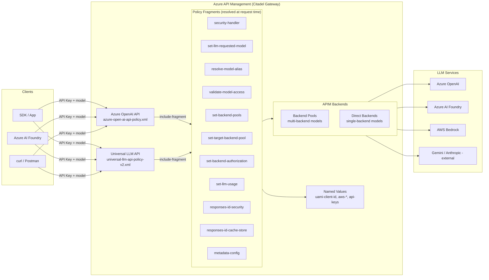
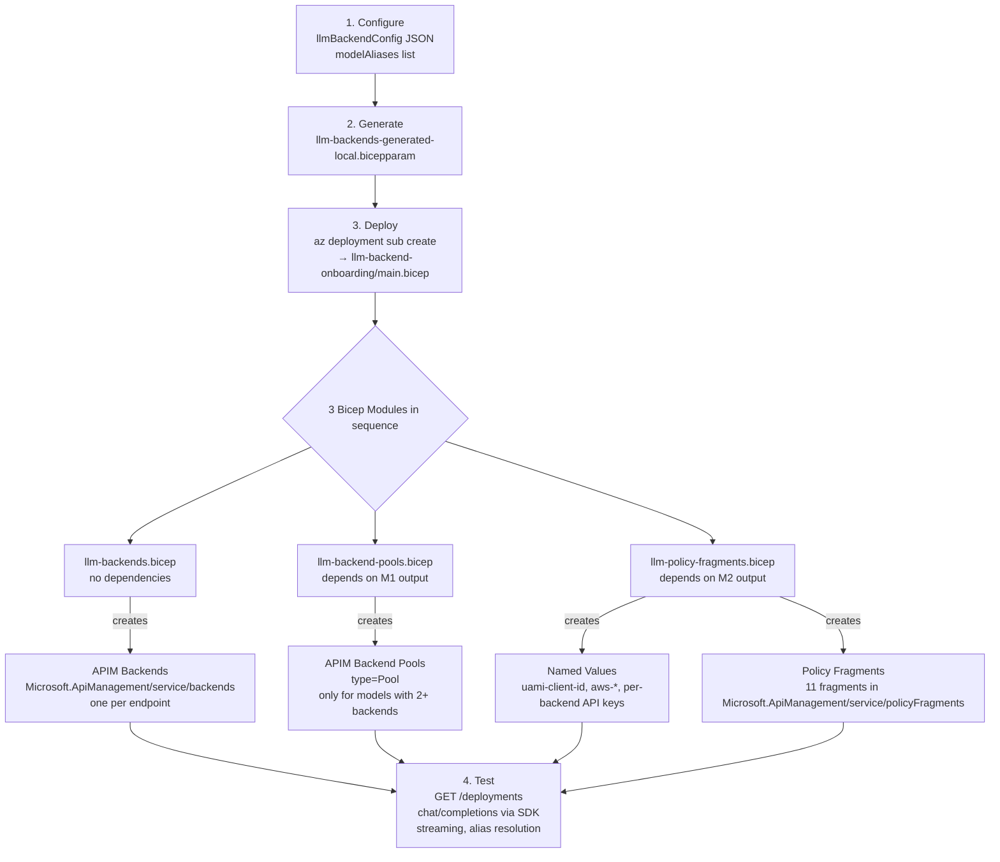
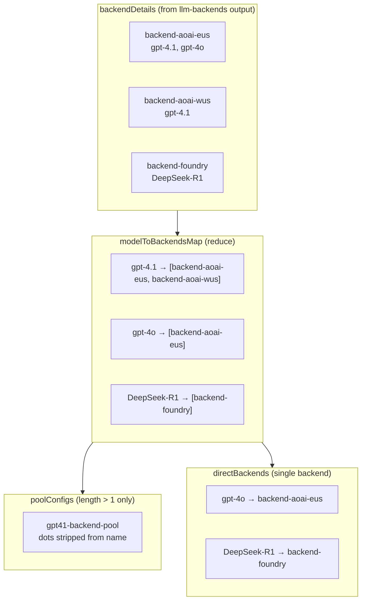
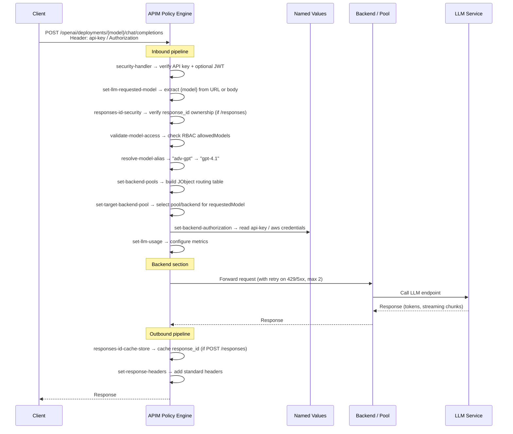
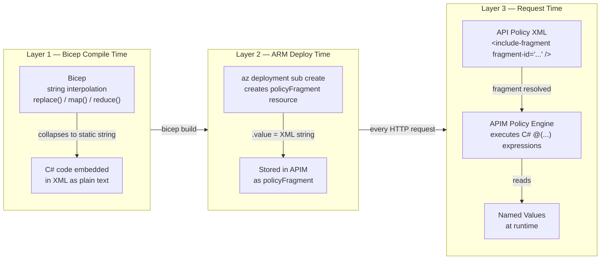
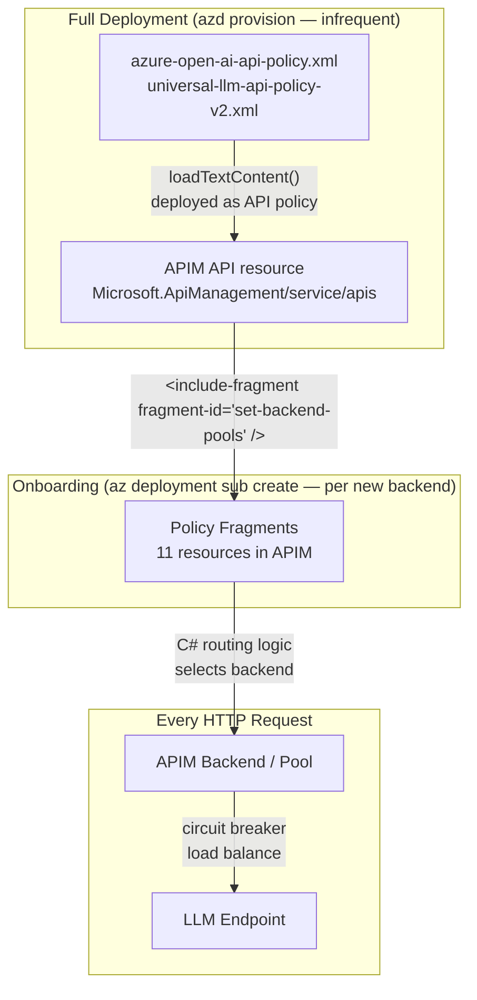
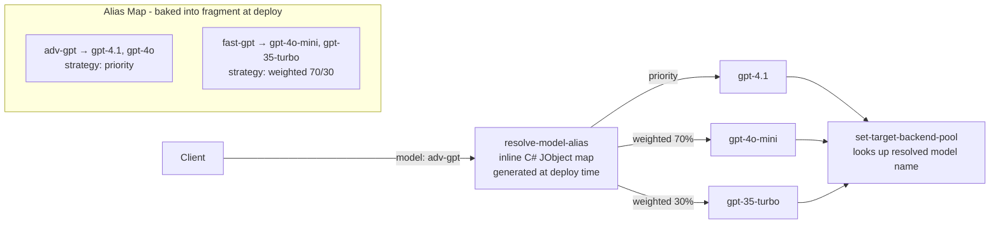

# LLM Backend Onboarding — Architecture Reference

## Overview

The onboarding system adds new LLM endpoints (Azure OpenAI, AI Foundry, AWS Bedrock, external providers) to the Citadel AI Hub Gateway **without redeploying the full infrastructure**. It operates entirely within Azure API Management (APIM) by creating backends, backend pools, named values, and policy fragments.

---

## Overall Architecture



---

## Onboarding Process

The onboarding notebook (`validation/llm-backend-onboarding-runner.ipynb`) drives three phases:



---

## Resource Types Created

### 1. APIM Backends (`llm-backends.bicep`)

Each entry in `llmBackendConfig` becomes one `Microsoft.ApiManagement/service/backends` resource.

| Property | Value |
|---|---|
| `name` | `config.backendId` — permanent ARM identity |
| `url` | LLM endpoint URL |
| `protocol` | `http` |
| `circuitBreaker` | 3 failures (429/500-503) in 5 min → 1 min trip |
| `credentials.managedIdentity` | Set only for `ai-foundry` / `azure-openai` backends |

**Auth type resolution chain:**

```
explicit authType
  → else: aws-bedrock          → aws-sigv4
  → else: external             → none
  → else: aws-bedrock-mantle   → api-key-bearer
  → else: gemini-openai        → api-key-bearer
  → else:                      → managed-identity
```

`managed-identity` is the only type configured on the Backend resource itself. All other auth types (`api-key`, `aws-sigv4`) are handled inside policy fragments using Named Values.

---

### 2. APIM Backend Pools (`llm-backend-pools.bicep`)

Pools are created **only for models supported by 2 or more backends**. A model with a single backend routes directly.



Pool name rule: `replace(modelName, '.', '') + '-backend-pool'` — APIM disallows dots in resource names.

---

### 3. Named Values (`llm-policy-fragments.bicep`)

| Named Value | Secret | Source |
|---|---|---|
| `uami-client-id` | No | `managedIdentityClientId` param |
| `aws-access-key` | Yes | `awsAccessKey` param |
| `aws-secret-key` | Yes | `awsSecretKey` param |
| `aws-region` | No | `awsRegion` param |
| `{config.authConfig.namedValueKey}` | Yes | Key Vault ref or inline value, per backend |

---

### 4. Policy Fragments (`llm-policy-fragments.bicep`)

Fragments are named XML resources (`Microsoft.ApiManagement/service/policyFragments`). The API policy XML references them via `<include-fragment fragment-id="..."/>`. They are **resolved at request time** on every call — updating a fragment takes effect immediately without redeploying the API policy.

#### Fragment Reference

| Fragment ID | Phase | Dynamic? | Purpose |
|---|---|---|---|
| `set-backend-pools` | Inbound | **Yes** — generated C# | Builds in-memory routing table (JObject per pool/backend) |
| `set-backend-authorization` | Inbound | No | Sets auth headers per backend type using Named Values |
| `set-target-backend-pool` | Inbound | No | Selects the target pool/backend by matching `requestedModel` |
| `set-llm-requested-model` | Inbound | No | Extracts model from URL path (Azure OAI) or request body |
| `set-llm-usage` | Inbound | No | Configures token usage metric collection |
| `get-available-models` | Inbound | **Yes** — generated C# | Intercepts `GET /deployments`, returns all known models |
| `validate-model-access` | Inbound | No | RBAC — blocks models not in `allowedModels` per product |
| `responses-id-security` | Inbound | No | Validates `response_id` ownership for Responses API |
| `responses-id-cache-store` | Outbound | No | Caches `response_id → subscriptionId` after POST /responses |
| `metadata-config` | Inbound | **Yes** — generated C# | Model→backend mapping for Unified AI API routing |
| `resolve-model-alias` | Inbound | **Yes** — generated C# | Resolves alias (e.g. `adv-gpt`) → real model, priority/weighted |

**Dynamic** means the fragment's C# code is generated at **Bicep compile time** from `llmBackendConfig` and embedded as a static string. The logic inside runs at request time — the C# itself never changes after deploy.

---

## Request Flow (Runtime)



---

## Three Compilation Layers

A critical concept: code that looks like C# in the Bicep file goes through three distinct stages.



**What this means practically:**
- `llmBackendConfig` shapes the C# routing table — changing it requires re-running the onboarding deployment
- API Keys in Named Values can be rotated **without redeploying** — the fragment reads them by reference at request time
- The API policy XML (`<include-fragment>` tags) is deployed once during full infrastructure deployment and rarely changes

---

## How Policy Fragments Connect to API Policies

The API policy XML is deployed **once** during full deployment (`apim.bicep` → `loadTextContent()`). It never changes when you onboard new backends. The connection is entirely through fragment IDs resolved at request time.



---

## Onboarding vs Full Deployment — Scope Comparison

| Aspect | Full Deployment (`azd provision`) | Onboarding (`az deployment sub create`) |
|---|---|---|
| Scope | Subscription — creates all infra | Subscription — APIM resources only |
| Bicep entry | `bicep/infra/main.bicep` | `bicep/infra/llm-backend-onboarding/main.bicep` |
| Creates APIM service | Yes | No (references existing) |
| Creates API policy XML | Yes | No (fragments only) |
| Frequency | Rarely (infra changes) | Per new LLM backend |
| Requires API key secrets | No | Yes (per backend) |
| Shared modules | No — duplicate copies | No — duplicate copies |

---

## Model Alias Resolution



**Access control note:** `validate-model-access` runs **before** alias resolution. RBAC is granted on the alias name, not on individual underlying models — no need to enumerate every model when granting access to a team.

---

## Troubleshooting Quick Reference

| Symptom | Fragment to check | Debug approach |
|---|---|---|
| 401 Unauthorized | `security-handler` | Check API subscription key / JWT product |
| 404 model not found | `set-llm-requested-model` | Verify model in URL path vs body |
| 403 model not allowed | `validate-model-access` | Check product `allowedModels` Named Value |
| 404 after alias call | `resolve-model-alias` | Re-run onboarding with updated `modelAliases` |
| 503 all backends failed | Circuit breaker on Backend resource | Check backend health; wait 1 min for trip to clear |
| /deployments returns wrong models | `get-available-models` | Re-run onboarding to regenerate fragment |
| Wrong backend selected | `set-backend-pools` + `set-target-backend-pool` | Use APIM `<trace>` to inspect `targetBackendPool` variable |
